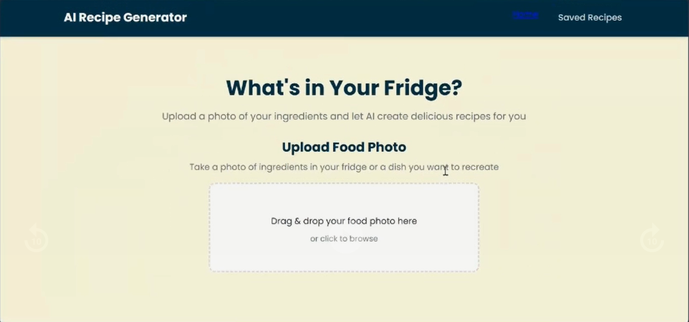
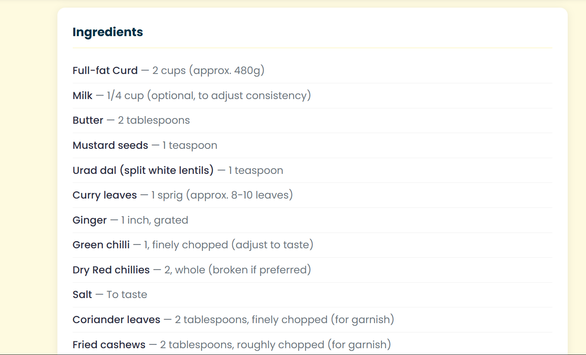
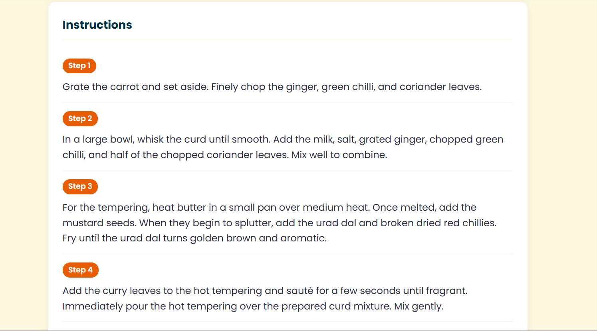
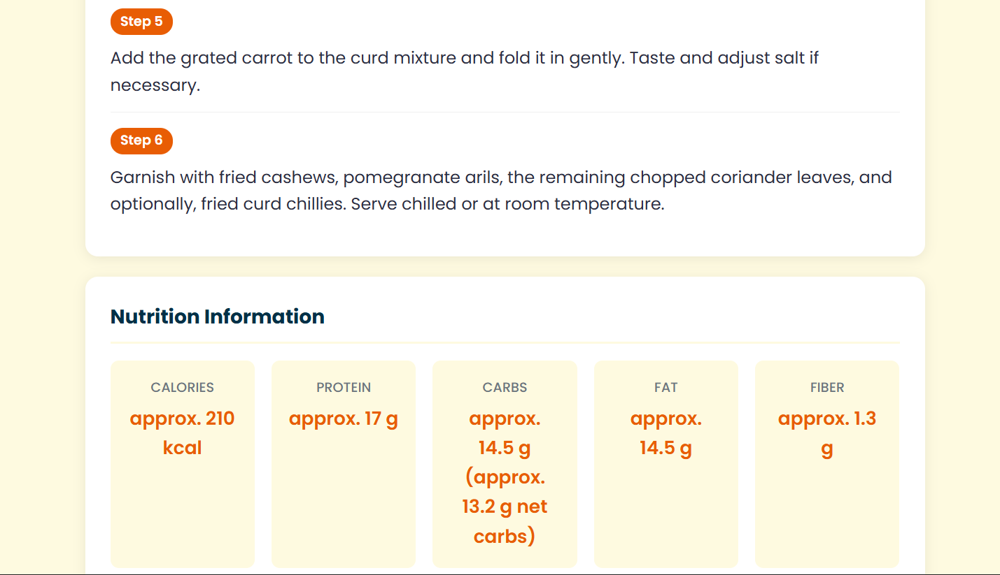
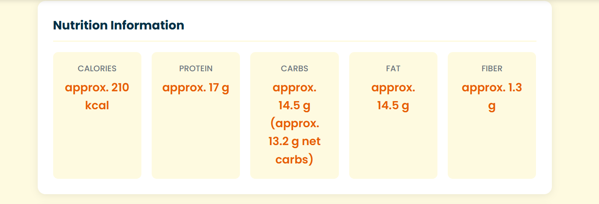
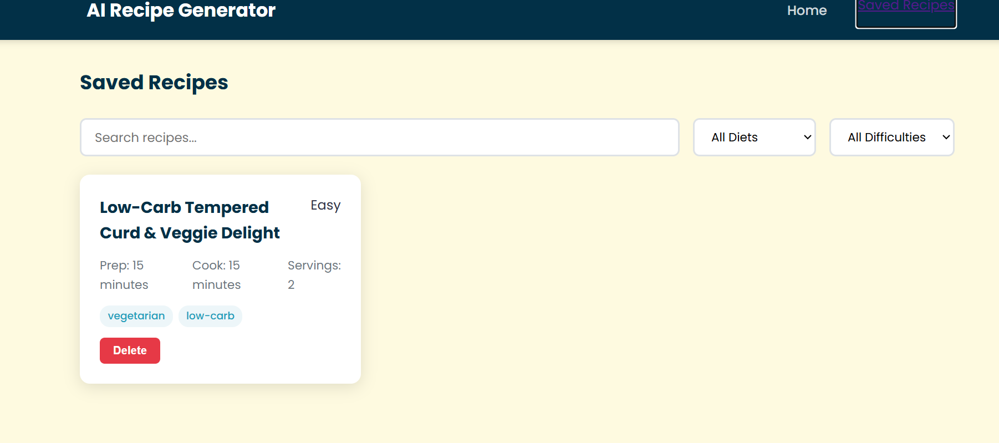

# 🍳 AI Recipe Generator

A modern, AI-powered web application that turns photos of your ingredients into delicious, personalized recipes. Simply upload a photo of your fridge or pantry, and let the AI do the rest!

## 📸 Project Gallery

### 🏠 Home & Upload


### 🔍 Ingredient Detection & Preferences


### 📖 Recipe Instructions & Nutrition




### 💾 Saved Recipes


## ✨ Features
- **🖼️ AI Vision Analysis**: Uses Google Gemini 2.5 Flash to identify ingredients from photos.
- **📜 Personalized Recipes**: Generates full recipes including instructions, nutrition facts, and dietary tags.
- **🧠 Smart Suggestions**: Get multiple recipe ideas based on what you have on hand.
- **💾 Save & Manage**: Store your favorite recipes in a Supabase database for later use.
- **🌓 Modern UI**: A beautiful, responsive interface with a premium "foodie" aesthetic.

## 🚀 Tech Stack
- **Frontend**: React.js, Vite, Vanilla CSS
- **Backend**: Node.js, Express
- **AI**: Google Gemini API (Vision & Pro)
- **Database**: Supabase (PostgreSQL)

## 🛠️ Installation & Setup

1. **Clone the repository**
   ```bash
   git clone https://github.com/Likhith206/ai-recipe-generator.git
   cd ai-recipe-generator
   ```

2. **Setup Backend**
   - Navigate to `Server` directory.
   - Run `npm install`.
   - Create a `.env` file with your keys.
   - Run `npm run dev`.

3. **Setup Frontend**
   - Navigate to `Client` directory.
   - Run `npm install`.
   - Run `npm run dev`.

## 📜 License
Distributed under the MIT License. See `LICENSE` for more information.

---
🚀 *Built with passion for the Google DeepMind Advanced Agentic Coding project.*
